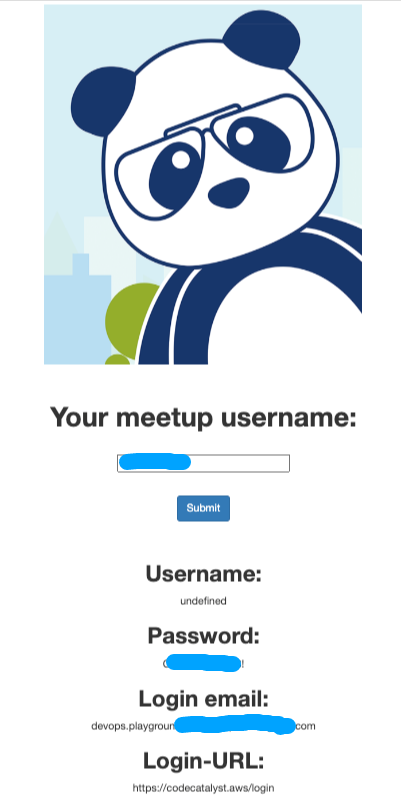
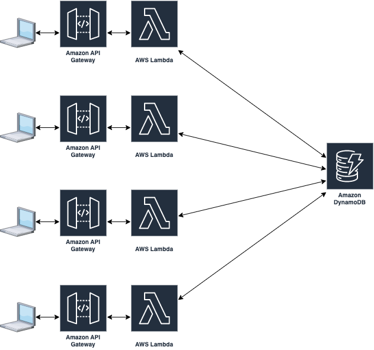

# DevOps Playground - January 2023
## Hands-on with Amazon CodeCatalyst

In this playground, we'll be exploring [Amazon CodeCatalyst](https://codecatalyst.aws), a new development/collaboration tool announced by AWS at re:Invent 2022. (The keynote announcement can be viewed [here](https://youtu.be/RfvL_423a-I?t=3486)).

We'll walk through various components of CodeCatalyst and try to deploy some python code, building a pipeline in CodeCatalyst to test and deploy the code as an AWS Lambda using Terraform.

## Initial Setup
As long as you registered for the PlayGround through MeetUp (or if you're internal to GlobalLogic, you responded to the email invite), you should be able to login to https://lab.devopsplayground.org/. In the username field, enter your meetup 'display name' or if you're internal, use 'firstname lastname'. When you click the `Submit` button, you'll be shown some details as shown below:

For the walkthrough, we'll ask you to login to https://codecatalyst.aws/login using the Login email and Password from the provided details. You'll also be allocated a 'panda name' which you can use throughout the workshop - this is the part of the email after the `+`, so if your login email was `devops.playground+chilled-panda@gmail.com`, then your panda name is `chilled-panda`.

Before the session started, we've created a CodeCatalyst Space and allocated each of you an individual project which uses your panda-name, and in each project, we've created a repository which contains some code we'll us throughout the project. The repository is cloned from https://github.com/DevOpsPlayground/hands-on-with-codecatalyst. If you want to follow along, this README file is available in the repo [here](https://github.com/DevOpsPlayground/hands-on-with-codecatalyst/blob/main/README.md).

## Agenda
The session should take approximately 60 minutes. Attendees do not need to have any previous experience with CodeCatalyst, Python or Terraform as example code will be provided.

### [Step 1. Creating a workflow to build our environment (_click_)](step1/README.md)
 - exploring CodeCatalyst
 - creating a workflow
 - adding build action
 - running the workflow

### [Step 2. Testing our code (_click_)](step2/README.md)
 - accessing a dev environment
 - editing workflow via dev environment & Cloud9
 - fixing missing files with artifacts
 - adding tests
 - running workflow

### [Step 3. Capturing test results (_click_)](step3/README.md)
 - adding reports
 - setting success criteria

### [Step 4. Deploying code to AWS (_click_)](step4/README.md)
 - adding workflow step
 - installing terraform
 - terraform init and plan
 - deploy
 - testing live (use restninja.io or https://www.site24x7.com/tools/restapi-tester.html)

# Final Architecture
The final deployment will deploy something that looks like
