# Exercise 1
[(_back to main readme_)](../README.md)

For this walkthrough, we have created a CodeCatalyst Space with projects for each individual. The projects are named with your 'panda' name and include the following:
* A code repository
* A non-prod deployment environment linked to an AWS account. Those accounts have an associated IAM role allowing us to deploy infrastructure into the account. The linked account includes
  * a S3 bucket which can be used to hold terraform statefiles
  * a dynamodb table which will be used by the code we deploy to track how many time our code is called (we could have used a CloudWatch metric, but that can take time to reflect a real count.)
  ---
## Accessing CodeCatalyst
1. Login to https://codecatalyst.aws/login - fill in the provided email address, click `Next`, enter the provided password, click `Sign in` and you'll see the CodeCatalyst Console, something like below:

  

2. Click the panda-name in the project space, and you'll be taken to an overview of your project.

 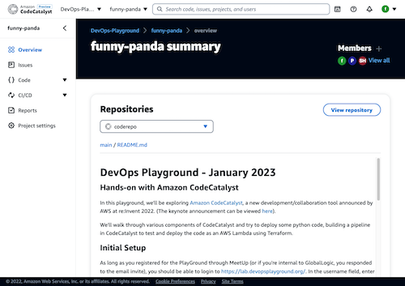 

---
## Creating a workflow
Now that we're in a project, let's create a workflow.

1. Click on `CI/CD` and select `Workflows` - this section should initially be empty, but we're going to create a workflow visually.
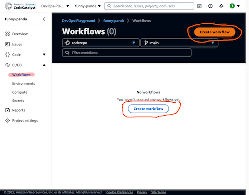

2. Click `Create workflow` button, and change the selector from `YAML` to `Visual` .
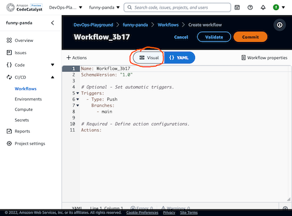
3. Click `Workflow properties` on the top RHS of the screen, under the `Commit` button. Change the workflow to `Example`, then click the tick. Click the `X` to close the properties.


4. The title of the workflow should now be Example. Click on the blue box in the center of the screen with the words `Source` and `Triggers`.

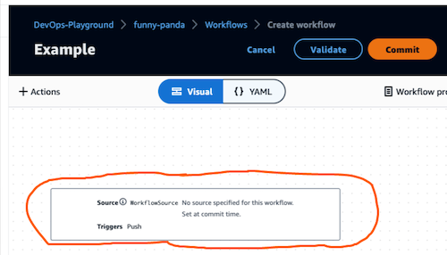

5. Click on the pen to the right of `Push`. Click `Remove` button next to `main`. Click the `Update` button.

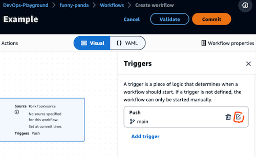

6. Click on the `+ Actions` underneath the name of the workflow. Click on `Build`. Click `Add to workflow`
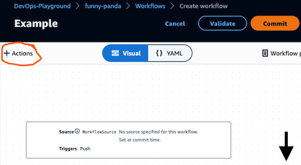

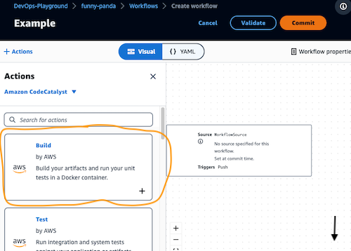

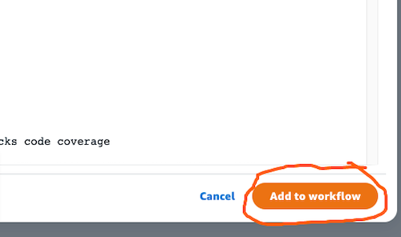

7. In the `Inputs` section, you'll see `WorkflowSource` is already in place which means we'll use the project repo. Click on `Configuration` and change the action name to `Init`, by clicking on the pen, changing the name and clicking on the tick.

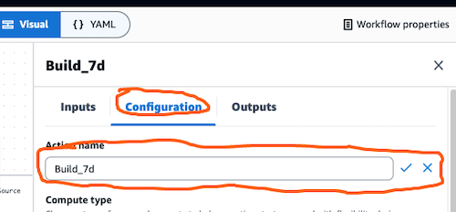

8. Scroll down to Shell commands and paste this code:
```
- Run: |
    echo "Install required environment libraries on ${HOSTNAME}"
    pip install --user -r env_requirements.txt
- Run: |
    echo "Install required code libraries"
    cd src
    pip install --user -r requirements.txt
```
9. Click the `X` to close the action.


10. Click `Validate` at the top of the screen and make sure it comes back with valid code.
11. Click `Commit` at the top of the screen.


  * Specify a name to use for the yaml file that will hold the workflow definition
  *   Add an appropriate commit message
  *   Click on repo dropdown and select the repo
  *   Click `main` for the branch name from the drop-down
  *   Click on the `Commit` button.
12. After a short delay, you'll be returned to the main Workflow screen and you should see a Run listed under your workflow name. You'll see the run has an id, a reference to the commit id, repo and branch.

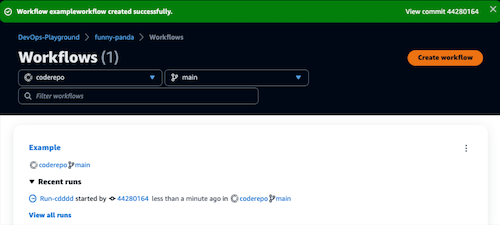

13. Click on the id (_something like `Run-d0ca1`_), and you'll see a visual representation of the run. Click on the action you added
14. Review the `Logs` section.
15. Click on `Overview` to return the project summary.

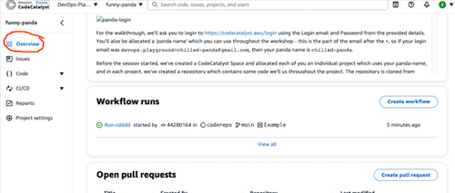
 

**Congratulations, you've created and executed your first workflow in CodeCatalyst.**

[(Jump to the 2nd exercise)](../step2/README.md) or [(_back to main readme_)](../README.md)