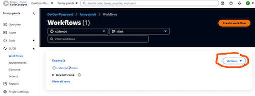
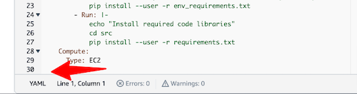
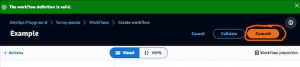
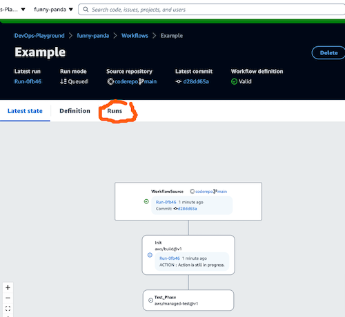
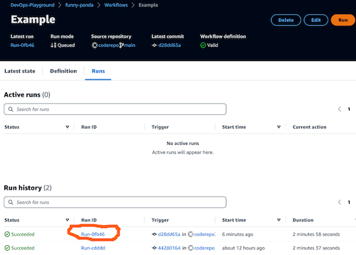
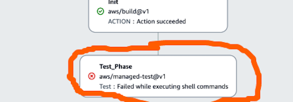
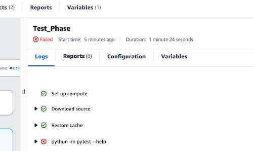
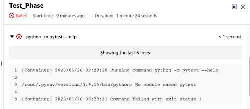

# Exercise 2

[(_back to main readme_)](../README.md)

We've created a workflow which has executed to build our initial environment
***Please shout if you didn't get a successful run before we continue***.
Now we're going to add an action to perform some tests on our python code.
---
1. Click `CI/CD` in the navigation column, then `Workflows`. You'll be able to see the workflow `Example` we created in the previous step. Click `Actions`, and from the dropdown, choose `Edit`.



2. Again, this will open in the YAML editor, which we will use this time. Scroll down to the bottom of the editor



3. Paste the following text into the editor below the line `Type: EC2`
```
  Test_Phase:
    Identifier: aws/managed-test@v1
    Inputs:
      Sources:
        - WorkflowSource
    Outputs:
      AutoDiscoverReports:
        Enabled: false
        ReportNamePrefix: rpt
    Configuration:
      Steps:
        - Run: |
            python -m pytest --help
    Compute:
      Type: EC2
    DependsOn:
      - Init
```
4. Click on `Validate` at the top of the screen to ensure our code is ok.
5. Click `Commit` at the top of the screen.



  * Specify a name to use for the yaml file that will hold the workflow definition
  *   Add an appropriate commit message
  *   Click on repo dropdown and select the repo
  *   Click `main` for the branch name from the drop-down
  *   Click on the `Commit` button.
6. After a short delay, you'll be returned to the main Workflow screen and you should see a new step for the test phase, and some information about the workflow. Click on `Runs`



7. Check in either `Active Runs` or `Run history` and you should see a run that is in progress, or just completed. Find the latest run and click on the run id to view the results.



1. Once you've opened the run, wait until the test phase is showing as failed.



9. Click on the `Test_Phase` box to open the details. You should see that the action failed at the python step. Click on the arrow next to the step to open it and see the error message.



10. You should see the step has failed due to python not being able to find the `pytest` library.



---

## So why did we fail?
When CodeCatalyst runs a new action, each one opens in a separate container. This means that any files generated will be lost unless we explicity archive them and transfer them - so let's do that.


## Part 1 - check our environment.
Let's add a new action to our workflow to check that the environment we built is in place, and then we'll use it to test our python code for the lambda we'll deploy.
1. Scroll to the end of the workflow file, which should have the shell commands you previously defined.
2. Paste the following code
```  
  Test_Phase:
    Identifier: aws/managed-test@v1
    Inputs:
      Sources:
        - WorkflowSource
    Outputs:
      AutoDiscoverReports:
        Enabled: false
        ReportNamePrefix: rpt
    Configuration:
      Steps:
        - Run: |
            echo "Check pytest is installed"
            python -m pytest --help
    Compute:
      Type: EC2
    DependsOn:
      - Init
```
***Make sure that the action in the `DependsOn` section uses the name of the action you defined in the first exercise.***
1. We've now added a test section (_see the identifier_) which we'll use to perform some tests against the code, but for now we're just checking the one of the tools, pytest, we installed in the previous action is available.
2. Save the file, either by `ctrl/cmd-s` or clicking `File > Save` in the menu at the top.
3. We can now use either the terminal or the git ide to update the repo. For the `terminal`
   1. In the terminal, enter the command `git status` and we should see that our modified file is listed in the `changes not staged for commit` section
   2. Enter the command `git add` followed by the name of our file to stage it in git
   3. Enter the command `git commit -m 'Added test phase'`
4. To use the `git IDE`, 
   1. Click on the small branch symbol in the navigator pane
   2. Click the plus sign next to our modified file in the explorer
   3. Enter a commit message
   4. `ctrl+enter` or `cmd+enter` to record the message for the comit
5. Click the small refresh symbol next to the branch name at the bottom of the screen to push our code back to the repository.
6. In the previous browser tab, click `CI/CD` and `Workflow`. We should see a new run listed against the workflow in the new branch. Click the run name and monitor the `Logs` section.
7. After a short period, we should see a red `x` next to the `pytest help` command.

## Why did our run fail?
Each action runs in a separate container, so when we installed the libraries and tools in the first action, they weren't visible in the second action's container.

## How to fix.
To make the files installed in our first container available to the second, we need to output an archive from the first file containing the library files (_held under /root/.local_), and then import that action in the 2nd action.

1. In the IDE editor, scroll to the first action and enter the following under the `Autodiscovered Reports` under `Outputs` section, just above `Configuration`
```
      Artifacts:
        - Name: pythonLibs
          Files:
            - /root/.local/**/*
```
(***Check the indentation***)
2. Scroll down to our new test action, and just above `Outputs` paste
```
      Artifacts:
        - pythonLibs
```
3. In the `Steps` section of our 2nd action, add the new step above the existing one
```
        - Run: |
            echo "Copying artifacts from build on ${HOSTNAME}"
            mv ${CATALYST_SOURCE_DIR_pythonLibs}/root/.local ~
            export PATH=$PATH:$HOME/.local/bin
            cd src
```
(***Again check indents***)
4. Save, stage, commit and sync our changes back to the repo (as above)
5. Check the workflow and we should see a new run which should complete successfully this time.
6. If you can't get the workflow working, use [example_workflow_with_artifacts.yaml](example_workflow_with_artifacts.yaml)

## Adding tests
Now that we have our installed tools available, we can proceed to analyse our lambda and terraform code. 

The lambda code is stored in `src/`, unit tests in `src/unittests` and terraform in `terraform`. We will use [bandit](https://pypi.org/project/bandit/) to check our python code for vulnerabilities, [tfsec](https://aquasecurity.github.io/tfsec) to check out terraform, and run unit tests to validate our lambda code.

Let's add those to our workflow.

1. Open the workflow file in our editor if it's not already (_hint, it's in `.codecatalyst/workflows`_)
2. Scroll down to the `Steps` section in the test action.
3. Replace these lines
```
        - Run: |
            echo "Check pytest is installed"
            python -m pytest --help
```
with
```
        - Run: |
            echo "Running unit tests"
            python -m pytest
            true
        - Run: |
            echo "Running bandit vulnerability scanner"
            bandit -r . --format sarif --output junit/bandit.sarif
            true    # Ignore failures flagged by bandit
        - Run: |
            echo "Installing and running tfsec"
            cd ../terraform
            wget https://github.com/aquasecurity/tfsec/releases/download/v1.28.1/tfsec-linux-amd64 -O tfsec
            chmod +x ./tfsec
            ./tfsec . --format sarif > ../src/junit/tfsec.sarif
            true
```
*The first command runs pytest, the second bandit, and the 3rd downloads `tfsec` and then executes it.*

4. Save, stage, commit and sync our changes back to the repo (as above)
5. Check the workflow and we should see a new run which should complete successfully this time.
6. If you can't get the workflow working, use [example_workflow_with_tests.yaml](example_workflow_with_tests.yaml)


[(Jump to the 3rd exercise)](../step3/README.md) or [(_back to main readme_)](../README.md)