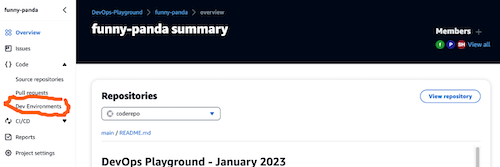
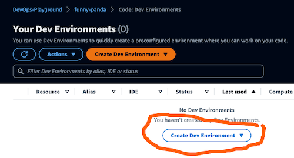
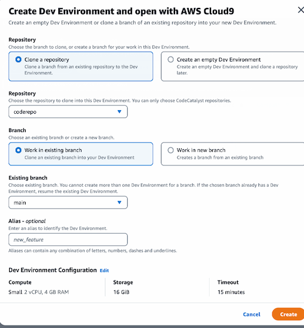
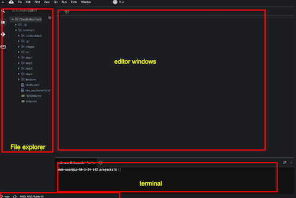

# Exercise 3
[(_back to main readme_)](../README.md)

So now we have a running workflow that setups a test environment, and performs various tests to make sure our code is good.

Before we try and deploy this to an AWS account, let's look at dev environments.

## What is a dev environment
One of the challenges development teams face is making sure that all team members have a consistent development environment - this leads to the 'but it works on my machine' comments ;)

CodeCatalyst dev environments aim to solve this by giving a standardised, cloud-based environment where everyone has the same configuration. 

This is available via either the Cloud9 IDE, or there are integrations to several popular local IDEs such as Visual Studio Code.

## Creating a dev environment
Let's create a Cloud9 based dev environment ...

1. From the navigation panel on the left hand side of the CodeCatalyst console, click the `Code` dropdown and select `Dev Environments`.

2. Click on one of the `Create Dev Environment` buttons

3. Choose `AWS Cloud9` from the dropdown. You'll see a screen where you can specify the options for the environment. Make sure that the repository is set to `coderepo` and `work in existing branch` is selected. Click `Create` at the bottom of the form

4. This will create a Cloud9 dev environment which includes a copy of the code from our repository. After short delay, this should open a new tab with access to the dev environment.
5. Close the `Getting started` window and click on `Don't show again` in the window about the dev environment settings.
6. You'll now see a screen looking like below

This has several sections
   * On the left, there is an explorer window showing the files available in the IDE. Our repo `coderepo` should be showing. There is also an icon here which allows us to interact with git, staging and committing files.
   * The main part of the screen is the editor section. We can double click a file in the explorer to open it in the editor, and we can have a number of files open at the same time.
   * There is a shell terminal at the bottom where we can run command line tools.
   * Finally at the bottom of the screen, is a status section showing us the state of our local git repository compared to the main repo held in CodeCatalyst.

It is also possible to link to local IDE such as Visual Studio Code. In the workshop, we'll demonstrate this but for more info, visit https://docs.aws.amazon.com/codecatalyst/latest/userguide/devenvironment-using-ide.html

[(Jump to the 4th exercise)](../step4/README.md) or [(_back to main readme_)](../README.md)